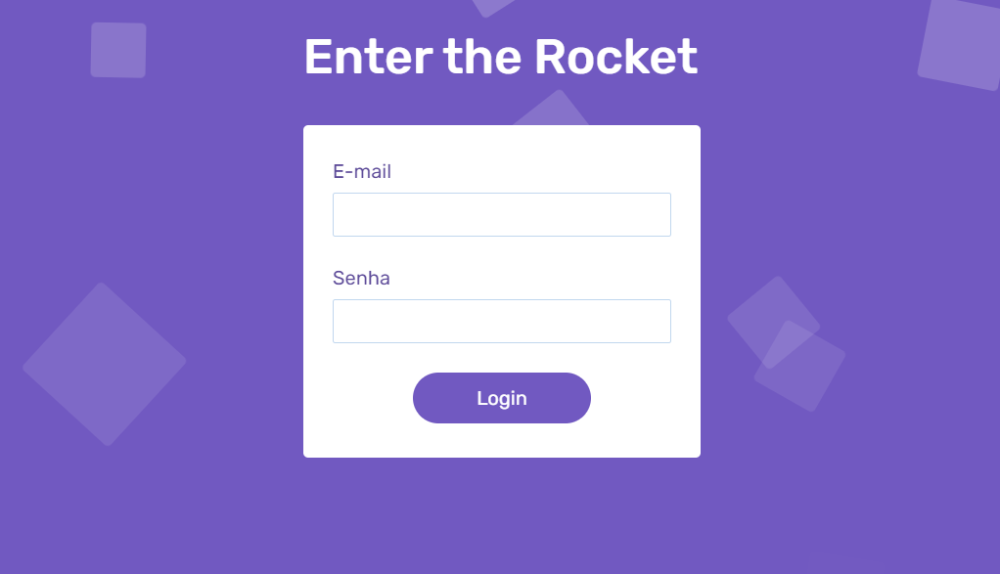

  

## About the component

  Having 5 different animations, divided into 4 moments / targets, that is, one in the background, two at the time of the form's appearance, one when the form is submitted without any information and, finally, one at the time of submission, the component in question references a form completely reactive to user actions.

## README versions

  <a href="https://github.com/trybrito/form-with-animated-squares-background/blob/main/README.md">
    Portuguese (pt-br)</a>
  |   
  <a href="https://github.com/trybrito/form-with-animated-squares-background/blob/main/README-en.md">
    English (en-us)</a>

