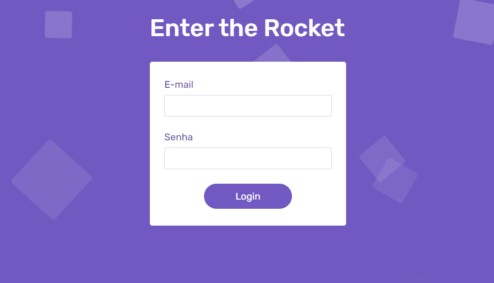

  

## Sobre o componente

  Possuindo 5 animações diferentes, divididas em 4 momentos / alvos, isto é, uma de fundo, duas no momento da aparição do formulário, uma quando o formulário é submetido sem nenhuma informação e, por fim, uma no momento de seu envio, o componente em questão referencia um formulário completamente reativo às ações do usuário.

## README versions

  <a href="https://github.com/ThiagoBrito-Dev/form-with-animated-squares-background/blob/main/README.md">
    Portuguese (pt-br)</a>
  |   
  <a href="https://github.com/ThiagoBrito-Dev/form-with-animated-squares-background/blob/main/README-en.md">
    English (en-us)</a>

